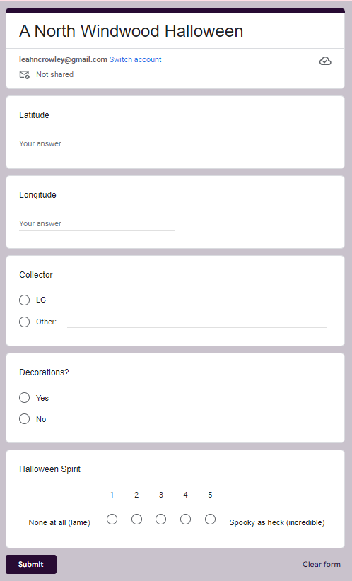
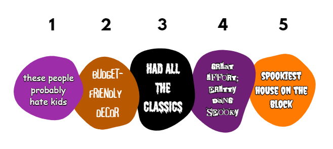
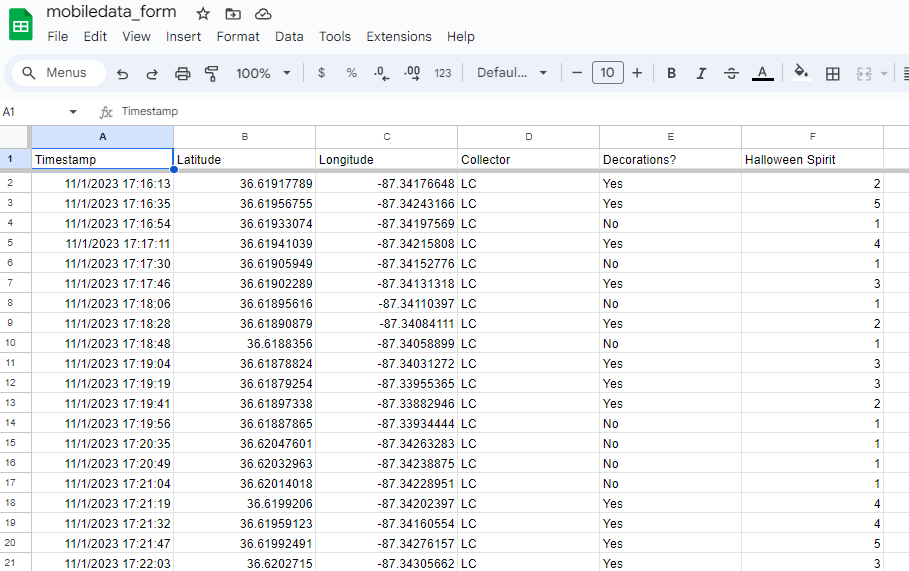

```{r setup, include=FALSE}
knitr::opts_chunk$set(echo = TRUE)

# Load relevant libraries to workspace: 
  library(tidyverse)
  library(leaflet)
  library(htmlwidgets)
  library(googledrive)

```

```{r Data, echo=FALSE}

# Read in relevant data:
  data <- read.csv("mobiledata_sheet.csv")

```

# Google Form



## Form information
The [Google form that I made for data collection](https://forms.gle/uXd8xeTC6C27YP687) is called "A North Windwood Halloween." And yes, I only learned the official name of my neighborhood because of this assignment. Anyway, this form was comprised of five basic questions/points of data collection:

-   ***Latitude -*** a short-answer response box

-    ***Longitude -*** another short-answer response box

-    ***Collector -*** a multiple-choice selection with an option for "LC" and an option for "Other"

-    ***Decorations?*** - another multiple choice question with simple "Yes" and "No" response options

-    ***Halloween Spirit*** - a linear-scale response ranging from 1-5...

## Halloween spirit scale



# Google Sheet
The [Google Sheet that I connected to the form](https://docs.google.com/spreadsheets/d/1dGCrX67utFIrrSzU9jj4QMlVwhGC8MyQ8L6uYdaCDAE/edit?usp=sharing) compiled all of the responses into one nice, tidy file that I was able to use as a .csv file to build my map. 



# Map
All of the houses on my street were surveyed for Halloween decorations and spirit. This map may serve as a guide for someone interested in knowing where the best candy is given out on Maliki Drive. However, to determine if there is a positive relationship between the amount of Halloween spirit a household has and the quality of candy they hand out on Halloween, we would need to collect more data, have more observers, and repeat the study for multiple years. 

## About the map
All surveyed houses are marked by a violet-colored circle. The radius of the circle signifies the relative amount of Halloween Spirit each house was deemed to have. Houses with more spirit (via decorations and vibes) have larger circles, and houses with lower amounts of spook have smaller circles. This map also includes multiple layers to choose from when viewing it. 

## The map itself:

```{r Map, echo=FALSE, message=FALSE, warning=FALSE}

# Make map showing data collected from neighborhood: 
  data.map <- leaflet(data) %>% 
                addTiles(group = "OSM") %>%
          addProviderTiles(providers$CartoDB.Positron, group = "CartoDB") %>%
          addProviderTiles(providers$Esri.NatGeoWorldMap, group = "NatGeo") %>%
          addProviderTiles(providers$Esri.WorldImagery, group = "ESRI") %>%
                addCircleMarkers(popup = data$Decorations.,
                     label = data$Halloween.Spirit,
                     lng = data$Longitude, 
                     lat = data$Latitude,
                     radius = data$spirit,
                         color = "black",
                         fillColor = "violet",
                         fillOpacity = 1) %>%
        addLayersControl(
          baseGroups = c("OSM", "CartoDB", "NatGeo", "ESRI"),
          options = layersControlOptions(collapsed = FALSE),
          overlayGroups = "Trees") %>%
        addMiniMap(zoomLevelOffset = -4) %>%
        addScaleBar()

# Run to display map as output:
  data.map
                  
```
